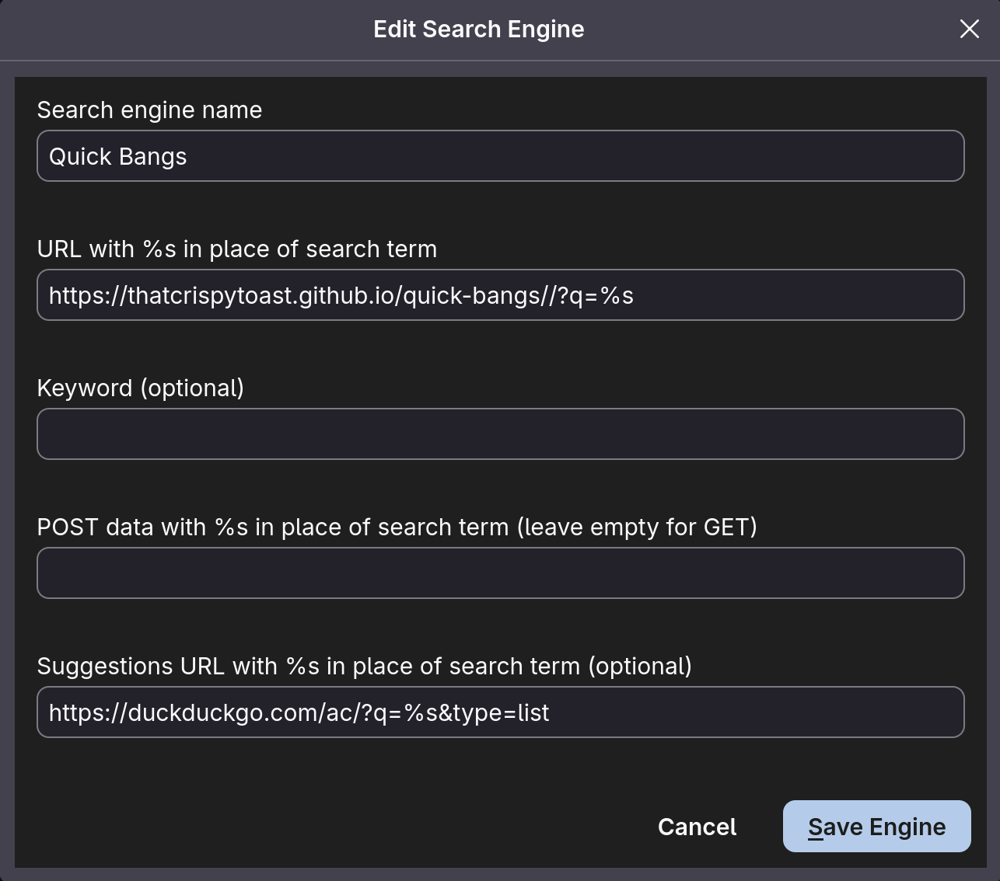
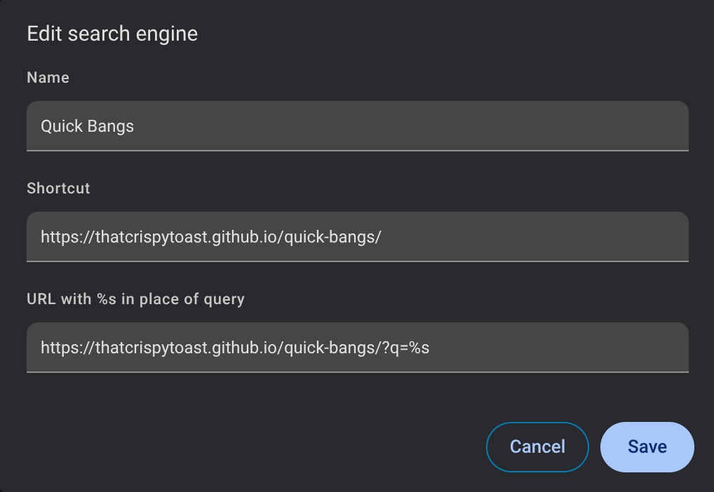

# quick-bangs
A suckless bang implementation with custom bang support.

## Configuration
> All configuration occurs in index.html directly.

**Default Search Engine**: If no bangs are specified, this engine is used.
**Quicker Bangs**: A series of key-value pairs (bang->search_engine) defining custom bangs. These are also fetched before the massive Kagi bang list, so commonly used bangs can be placed here for faster resolution.

## Installation

### Getting Your URL

#### Self-Hosted
Clone the repo. Deploy however you deploy your staic web apps.
#### Public Instance
A public instance of quick-bangs is availbile at https://thatcrispytoast.github.io/quick-bangs/.

### Adding the Search Engine

**Query URL:** `https://thatcrispytoast.github.io/quick-bangs/?q=%s`

#### Firefox and Firefox Forks (zen, tor, librewolf, floorp, etc.)
Add the engine with the query parameter above to your "Search Shortcuts" list. Replace the base URL if hosting the project locally. Optionally, a suggestion URL of your choice can be added. The example below uses the DuckDuckGo suggestion engine. Set as default by selecting it under the "Default Search Engine" dropdown after adding.

#### Google Chrome and Chromium-Based Browsers (brave, vivaldi, ungoogled-chromium, opera, etc.)
Add the engine with the query parameter above to your "Site Search" list. Replace the base URL if hosting the project locally. Set as default by clicking the three dots of the left of the newly created search shortcut and seelction "Make default" from the menu.

